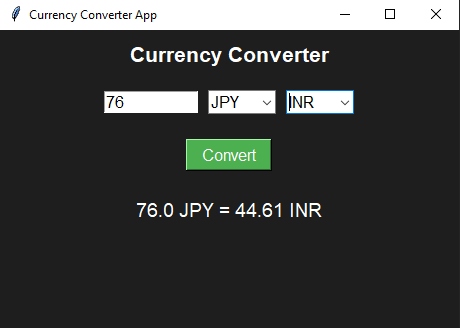

# 💱 Currency Converter App – Python + Tkinter

A simple and elegant **desktop GUI app** built using **Python Tkinter** that lets you convert currencies in real-time. The app fetches exchange rates from an external API and supports popular currencies like USD, INR, EUR, GBP, and more.

---

## 🖥️ Features

- 🔁 Convert between major currencies (USD, INR, EUR, GBP, JPY, etc.)
- 🌐 Real-time exchange rate via external API
- 🧠 Input validation with helpful messages
- 🖌️ Clean, dark-themed GUI built with Tkinter
- 🛠️ Customizable and extensible

---

## 📸 Screenshots




---

## ⚙️ Tech Stack

- 🐍 [Python 3.x](w)
- 🖼️ [Tkinter](w) – GUI Framework
- 🌐 [requests](w) – for API calls
- 🔐 [python-dotenv](w) – for managing environment variables

---

## 🛠️ Getting Started

### 1. Clone the Repository

```bash
git clone "https://github.com/ayushverma2909/Tamizhan-Skills-Internship.git"

```
Make Sure your current directory is


```bash

cd "Python Programming/Project 1 Currency Converter App"
touch .env

```
### Add this to your .env file

API_KEY = 'YOUR API KEY'
URL = 'https://api.currencyapi.com/v3/latest'

Visit the URL and get your own API KEY and replace this api key

```bash

python main.py

---

## 📄 License

Licensed under the [MIT License](w).

---

## 🙋‍♂️ Author

Made with ❤️ by [Ayush Verma](https://github.com/ayushverma2909)


