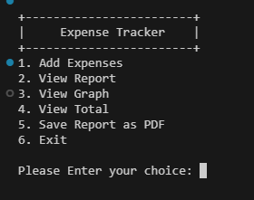
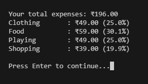

# 💸 Expense Tracker CLI App – Python

A powerful command-line **Expense Tracker** app built with **Python**, featuring CSV storage, data visualization, and PDF export. Perfect for tracking daily spending, analyzing expense categories, and saving clean reports.

---

## ✨ Features

- ✅ Add new expenses with category and timestamp
- 📊 View detailed expense reports in table format
- 📈 Graphical pie chart of expenses by category
- 💸 Total spending summary with category-wise breakdown
- 🧾 Save all data to a downloadable PDF report
- 💾 Data stored in `CSV` format for easy portability
- 🧠 Intelligent formatting and input validation

---

## Screenshots



---

## 🖥️ Tech Stack

- 🐍 Python 3.x
- 📦 [pandas](w)
- 📊 [matplotlib](w)
- 📃 [tabulate](w)
- 📄 [reportlab](w)
- 💻 OS modules and cross-platform terminal support

---

## 🛠️ Getting Started

### 1. Clone the Repository

```bash
git clone "https://github.com/ayushverma2909/Tamizhan-Skills-Internship.git"

```
Make Sure your current directory is


```bash

cd "Python Programming/Project 2 Expense Tracker"
pip install pandas matplotlib tabulate reportlab
python main.py

---

## 📄 License

Licensed under the [MIT License](w).

---

## 🙋‍♂️ Author

Made with ❤️ by [Ayush Verma](https://github.com/ayushverma2909)
