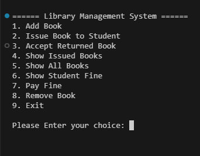

# 📚 Library Book Management System – Python CLI

A complete **command-line based Library Book Management System** built using Python. This system allows **admins** and **students** to manage books efficiently, with features like issuing/returning books, fine calculation, and record-keeping using JSON files.

---

## ✅ Features

### Screenshot


### 👩‍🎓 Student Functionalities
- 📖 Issue books by name
- 📅 Automatically tracks issue date
- ⏱ 5-day free period, ₹20/day fine afterwards
- 📤 Return books (fine check before return)
- 💳 Check and pay pending fines
- 👁 View list of issued books with timestamp and fine details

### 🛠️ Admin Functionalities
- ➕ Add new books with ID, cost, quantity
- ❌ Remove books securely using admin credentials
- 📘 View full list of available books
- 🔐 Admin login via environment variables (`.env`)

---

## 🗃️ Data Storage

- `books.json` → Stores all available books with ID, name, cost, quantity
- `issued_books.json` → Tracks books issued by each student, with timestamps
- `.env` → Stores secure admin credentials

---

## ⚙️ Tech Stack

- 🐍 Python 3.x
- 📁 JSON for data persistence
- 🕒 `datetime` module for time tracking
- 📦 `python-dotenv` for environment variable management

---

## 🛠️ Getting Started

### 1. Clone the Repository

```bash
git clone "https://github.com/ayushverma2909/Tamizhan-Skills-Internship.git"

```
Make Sure your current directory is


```bash

cd "Python Programming/Project 3 Library Management System"
touch .env

```
### Add this to your .env file

ADMIN_ID=admin123
ADMIN_PASSWORD=123456

```bash

python main.py

---

## 📄 License

Licensed under the [MIT License](w).

---

## 🙋‍♂️ Author

Made with ❤️ by [Ayush Verma](https://github.com/ayushverma2909)

