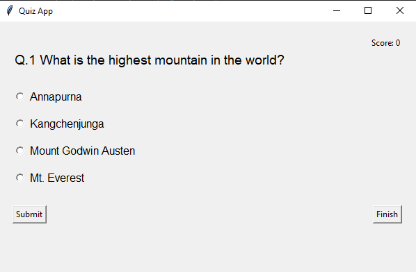
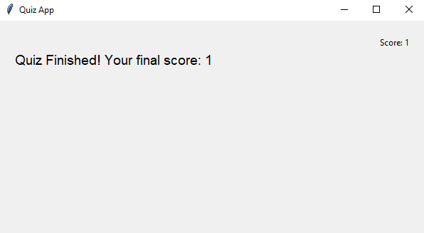

# ❓ Quiz App – Python + Tkinter

A clean and interactive **Quiz Application** built with **Python** and **Tkinter**. This app fetches questions in real-time from the **Open Trivia API** and allows users to attempt a 10-question quiz with score tracking and immediate feedback.

---

## ✅ Features

### Screenshot



### 🧠 Functionality

- 🔄 **Fetches Questions** dynamically from [Open Trivia DB](https://opentdb.com)
- 📝 **Multiple Choice Questions** with randomized answers
- 🟢 **Instant Feedback** after each submission
- 🧮 **Score Tracking** (+1 for correct, -1 for incorrect)
- 🖱️ **Finish Button** to end the quiz at any time
- 💬 **User-friendly Interface** using Tkinter GUI
- 🎯 New quiz starts automatically after completing all questions

---

## 🗃️ Tech Stack

- 🐍 Python 3.x
- 🖼️ [Tkinter](w) for GUI
- 🌐 [Requests](w) for API calls
- 🔤 [html](w) module for decoding HTML entities in questions

---

## 🛠️ Getting Started

### 1. Clone the Repository

```bash
git clone "https://github.com/ayushverma2909/Tamizhan-Skills-Internship.git"

```
Make Sure your current directory is


```bash

cd "Python Programming/Project 4 Quiz App"
python main.py

---

## 📄 License

Licensed under the [MIT License](w).

---

## 🙋‍♂️ Author

Made with ❤️ by [Ayush Verma](https://github.com/ayushverma2909)


