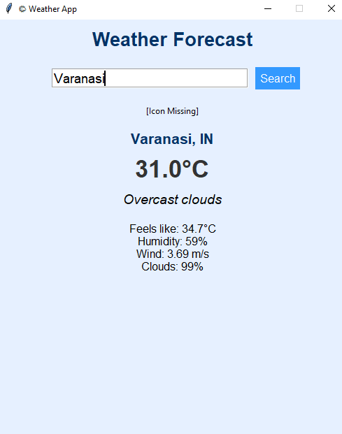

# 🌤️ Weather App – Python + Tkinter + OpenWeatherMap API

A simple and beautiful **Weather Forecast Desktop App** made using **Python**, **Tkinter**, and the **OpenWeatherMap API**. It fetches real-time weather data and displays temperature, humidity, wind speed, cloudiness, and a weather icon — all with a clean GUI layout.

---

## ✅ Features

### Screenshot


### 🌦️ What it does:

- 📍 Search any **city name**
- 🌡️ Shows **current temperature** and **"feels like"** value
- 🌬️ Displays **wind speed**, **humidity**, and **cloud percentage**
- ☁️ Weather **description** with real-time icon
- 🧭 Fully GUI-based app using **Tkinter**
- 🚫 Error handling for empty or invalid cities
- 🎨 Clean and responsive design

---

## 🗃️ Tech Stack

- 🐍 Python 3.x
- 🖼️ [Tkinter](w) – for GUI
- 🌐 [OpenWeatherMap API](https://openweathermap.org/)
- 🔑 [python-dotenv](w) – for environment variable support
- 🧾 [requests](w) – for API calls

---

## 🛠️ Getting Started

### 1. Clone the Repository

```bash
git clone "https://github.com/ayushverma2909/Tamizhan-Skills-Internship.git"

```
Make Sure your current directory is


```bash

cd "Python Programming/Project 5 Weather App"
touch .env

```
### Add this to your .env file

API_ID = Your api id

```bash

python main.py

---

## 📄 License

Licensed under the [MIT License](w).

---

## 🙋‍♂️ Author

Made with ❤️ by [Ayush Verma](https://github.com/ayushverma2909)


