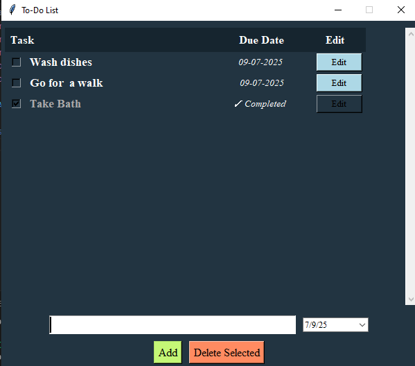

# ✅ To-Do List App – Python + Tkinter + tkcalendar

A visually enhanced **To-Do List Desktop App** built using **Python** and **Tkinter** with **date picker support**. It allows users to create, edit, check off, and manage daily tasks with due dates and completion tracking.

---

## 📸 Screenshot



---

## ✅ Features

### 🧑‍💻 User Functionalities

- ➕ Add new tasks with a due date
- 📝 Edit any task
- 🗑 Delete selected task
- ✅ Mark tasks as completed
- 📅 Auto-hide due date for completed tasks (shows ✓ Completed)
- 📋 Automatically saves tasks to local storage
- 💾 Data persists in `tasks.json`
- 📜 Scrollable task area with clean design
- 🕶 Highlight selection with hover effects

---

## 🛠️ Tech Stack

- 🐍 Python 3.x
- 🖼️ [Tkinter](w) – GUI toolkit
- 📆 [tkcalendar](w) – for date selection
- 🗃️ [JSON](w) – for saving tasks

---

## 🛠️ Getting Started

### 1. Clone the Repository

```bash
git clone "https://github.com/ayushverma2909/Tamizhan-Skills-Internship.git"

```
Make Sure your current directory is


```bash

cd "Python Programming/Project 6 Todo App"
python main.py

---

## 📄 License

Licensed under the [MIT License](w).

---

## 🙋‍♂️ Author

Made with ❤️ by [Ayush Verma](https://github.com/ayushverma2909)


