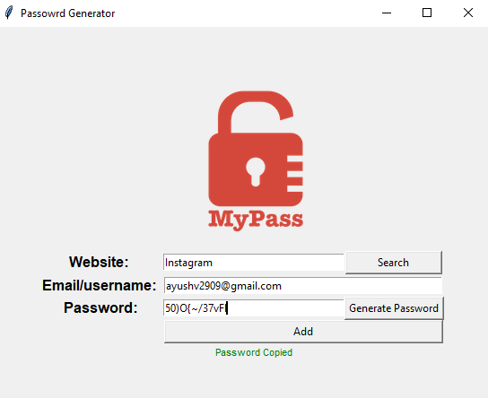

# 🔐 Password Generator App – Python + Tkinter

A sleek and secure **Password Generator Desktop App** built using **Python and Tkinter**. It allows you to generate strong passwords, store them locally, search saved credentials, and **automatically copy passwords to clipboard** on generation.

---

## 📸 Screenshot



---

## ✅ Features

### 🧑‍💻 User Functionalities

- 🔐 **Password Generator**  
  - Generates secure passwords using random combinations of **letters, numbers, and symbols**
  - Shuffles characters for enhanced randomness
  - ⚡ **Auto-copies** the generated password to clipboard instantly
  - Restricts passwords longer than 12 characters

- 💾 **Data Storage (Local)**  
  - Stores credentials (`website`, `email/username`, `password`) in `data.json`
  - Updates existing entries for repeated websites

- 🔍 **Search Functionality**  
  - Instantly retrieve stored credentials by website name
  - Displays matching credentials via pop-up dialog

- 🛡️ **Error Handling**  
  - Prompts if any field is left empty
  - Alerts for missing JSON file or unknown website entries


---

## 🛠️ Tech Stack

- 🐍 Python 3.x
- 🖼️ [Tkinter](w) – GUI toolkit
- 📁 [JSON](w) – Local data storage
- 🗝 [pyperclip](w) – Clipboard access for copying passwords

---

## 🛠️ Getting Started

### 1. Clone the Repository

```bash
git clone "https://github.com/ayushverma2909/Tamizhan-Skills-Internship.git"

```
Make Sure your current directory is


```bash

cd "Python Programming/Project 7 Password Generator Tool"
python main.py

---

## 📄 License

Licensed under the [MIT License](w).

---

## 🙋‍♂️ Author

Made with ❤️ by [Ayush Verma](https://github.com/ayushverma2909)


