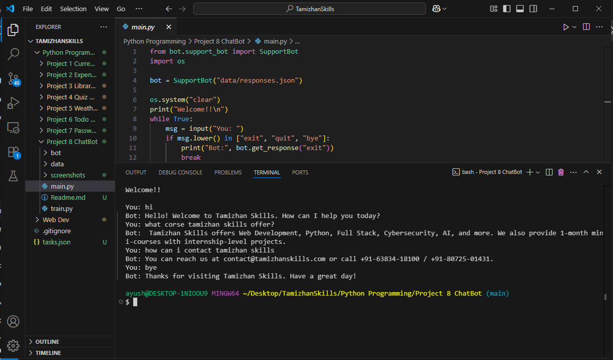

# 🤖 Rule-Based Chatbot – Tamizhan Skills FAQ Assistant

A modular, rule-based **chatbot built using Python and NLTK** that intelligently answers frequently asked questions related to Tamizhan Skills courses, including Python, Web Development, internship programs, and more.

This chatbot is **entirely offline**, uses **dictionary/intent-based matching**, and supports **text preprocessing** like tokenization, lemmatization, and stopword removal using NLTK. It’s designed to be easy to expand and customize.

---

## 📸 Screenshot




---

## ✅ Features

- 🧠 **Rule-Based Logic** using if-else/dictionary intent matching
- 💬 Responds to greetings, course-related queries, internships, durations, and pricing
- 🧹 **Natural Language Preprocessing** with NLTK (tokenization, lemmatization, stopword removal)
- 🔄 **Training Script** to easily update/add new intents from a JSON file
- 🧾 Responses are **stored in `responses.json`** for easy management
- 🏗️ Clean and modular file structure
- 📡 Works completely **offline** (no API required)

---

## 🧠 Example Questions It Can Answer

- `What is Tamizhan Skills?`
- `Tell me about your internship.`
- `What is the duration of the Python course?`
- `Do you provide certificates?`
- `How much does it cost?`
- `Hi`, `Hello`, `Bye`, etc.


---

## 🛠️ Tech Stack

- 🐍 [Python 3.x](https://www.python.org/)
- 🧠 [NLTK](https://www.nltk.org/) – Natural Language Toolkit
- 🗃️ JSON – Stores all intents/responses
- 📂 CLI-based application with clear modularity

---

## 🛠️ Getting Started

### 1. Clone the Repository

```bash
git clone "https://github.com/ayushverma2909/Tamizhan-Skills-Internship.git"

```
Make Sure your current directory is


```bash

cd "Python Programming/Project 8 ChatBot"
python main.py

---

## 📄 License

Licensed under the [MIT License](w).

---

## 🙋‍♂️ Author

Made with ❤️ by [Ayush Verma](https://github.com/ayushverma2909)
