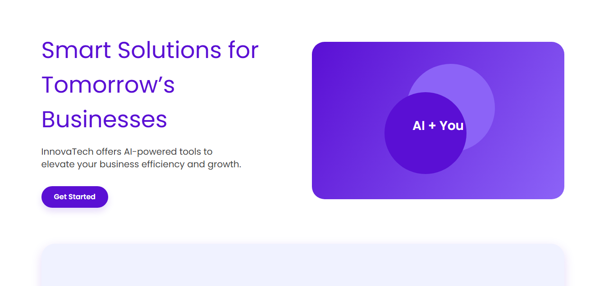
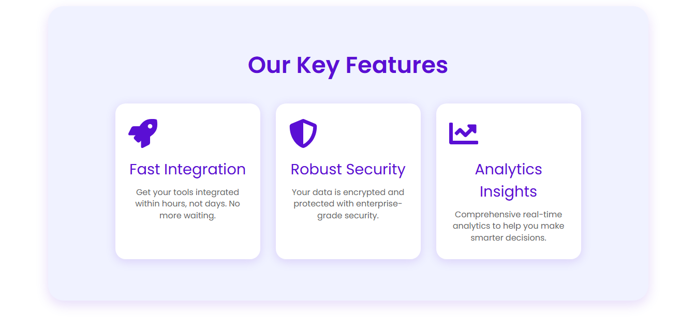
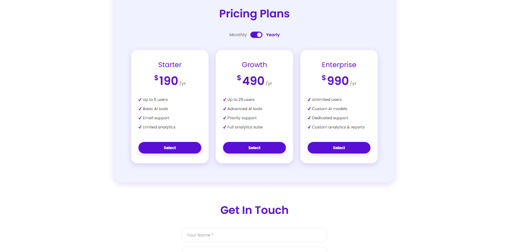

# 🚀 Startup Landing Page – React + Vite

A modern and fully responsive **landing page** for a fictional startup, designed with **React + Vite** and styled for clean UI, strong CTAs, and real-world usability. This project simulates an actual client product page that adapts beautifully across desktop, tablet, and mobile.

[🌐 Live Demo](https://your-landing-page.vercel.app) <!-- Replace with your live link -->

---

## ⚙️ Tech Stack

- ⚛️ React
- ⚡ Vite
- 🎨 Tailwind CSS (or your custom CSS)
- 📩 Email.js or form backend (optional for contact)

---

## 🎯 Features

- 🖼 **Hero Section** with headline, subheading & CTA button
- ✨ **Services/Features Section** to highlight offerings
- ⭐ **Testimonials** to build credibility
- 💸 **Pricing Plans** clearly laid out
- 📬 **Contact Form** for lead generation
- 📱 **Fully Responsive** – mobile-first layout
- ⚡ **Fast Build & Deploy** via Vite + Vercel

---

## 📸 Screenshots





---

## 🛠️ Getting Started

### 1. Clone the Repository

```bash
git clone "https://github.com/ayushverma2909/Tamizhan-Skills-Internship.git"

```
Make Sure your current directory is


```bash

cd "Web Dev/Project 2 Startup Landing page"
npm install
npm run dev

---

## 📄 License

Licensed under the [MIT License](w).

---

## 🙋‍♂️ Author

Made with ❤️ by [Ayush Verma](https://github.com/ayushverma2909)
