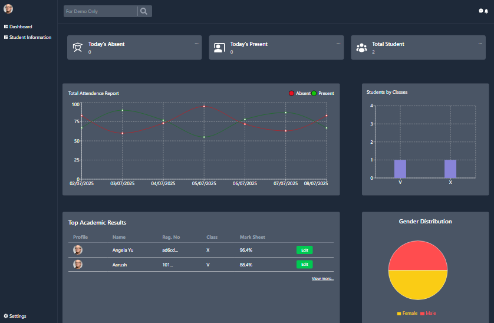
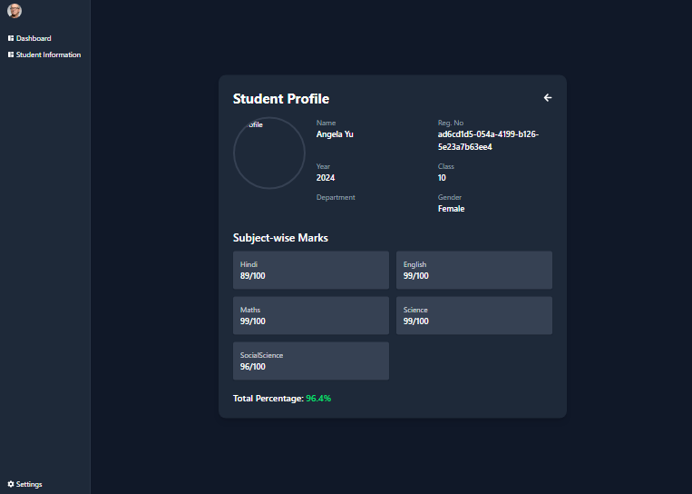
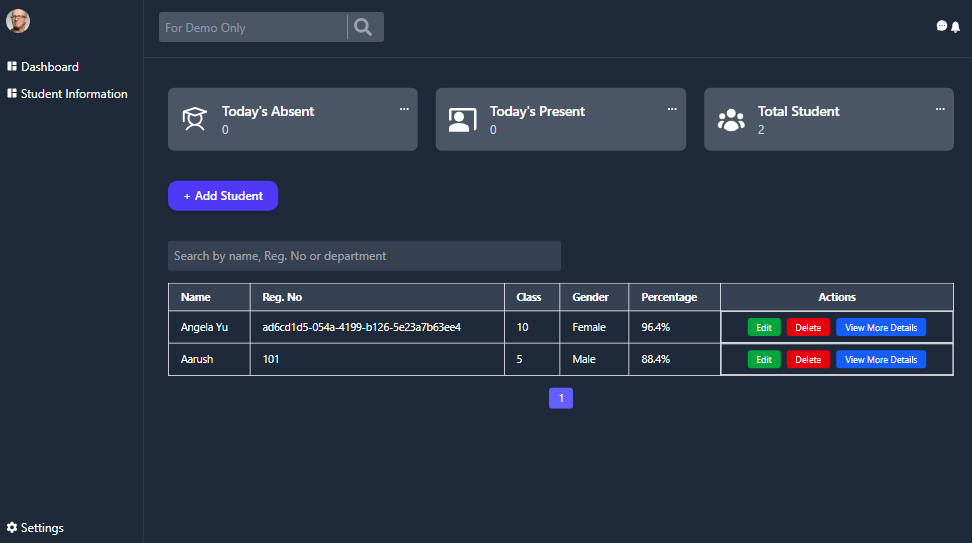
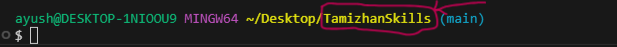

# 🎓 Student Management Dashboard

A **responsive**, **feature-rich**, and **visually intuitive** Student Management Dashboard built with **React (Vite)** and **Tailwind CSS**. It allows easy handling of student data with full **CRUD operations**, **search**, **pagination**, and **graphical analysis** using **Chart.js**.

## 🚀 Features

- 📊 **Graphical Representation** of student performance using [Chart.js](w)
- 🧑‍🎓 **Student Cards** to showcase individual student data
- 📋 **Interactive Table** view for easy bulk management
- 🔍 **Search Functionality** by Name or Registration Number
- 🛠️ **Full CRUD Support** (Add, Edit, Delete, View)
- 📱 **Fully Responsive UI** optimized for all devices
- 💡 **Clean UI/UX** using [Tailwind CSS](w)
- 📄 **Pagination** support for managing large datasets

---

## 📷 Screenshots

> Replace the image URLs below with your actual hosted screenshots.

### 🔹 Dashboard Overview


### 🔹 Student Cards


### 🔹 Graphical Report


---

## 🔗 Live Demo

👉 [Click here to view the live demo](https://your-demo-link.com)  

---

## 🧱 Tech Stack

- ⚛️ [React](w) (with [Vite](w) for fast dev)
- 🎨 [Tailwind CSS](w)
- 📊 [Chart.js](w)
- 🔍 JavaScript (ES6+)

---

## 🛠️ Getting Started

### 1. Clone the Repository

```bash
git clone "https://github.com/ayushverma2909/Tamizhan-Skills-Internship.git"

```
Make Sure your current directory is


```bash

cd "Web Dev/Project 5 Student Dashboard"
npm install
npm run dev

---

## 📄 License

Licensed under the [MIT License](w).

---

## 🙋‍♂️ Author

Made with ❤️ by [Ayush Verma](https://github.com/ayushverma2909)