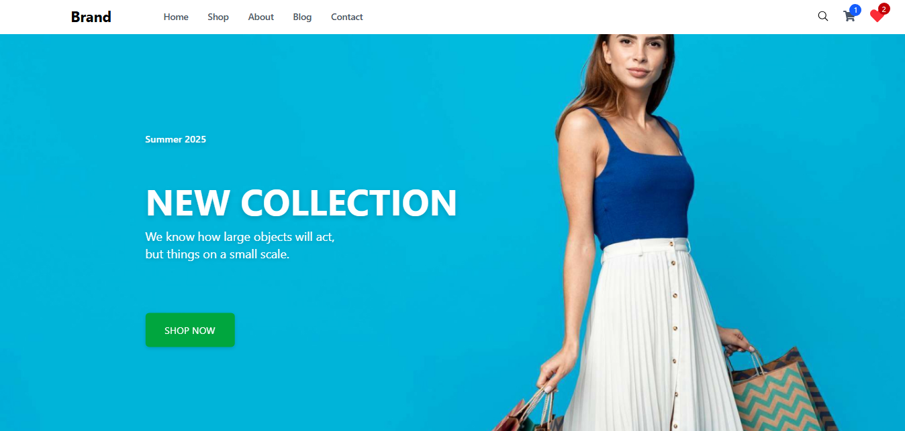
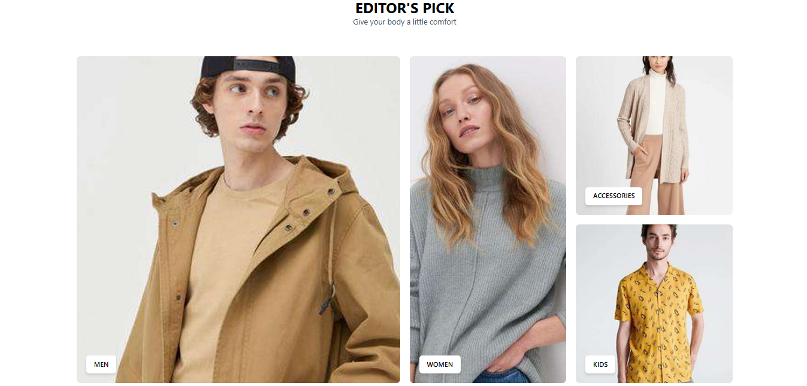
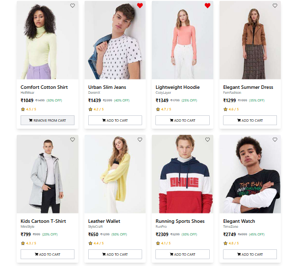

# 🛍️ React E-Commerce Website

A fully functional and responsive **E-Commerce web application** built using **React** and **Tailwind CSS**, featuring a complete shopping experience — from product listing to wishlist, cart, billing, and search filtering.

---
## 🖼️ Screenshots

---

## 🚀 Features

- 🔍 **Smart Search with Filtered Suggestions**
  - Inline animated search box
  - Closes on outside click or Escape
  - Suggests and filters products live

- 🛒 **Cart & Wishlist**
  - Add/remove products
  - Persistent with `localStorage`
  - Badge counter updates in real time
  - Syncs across components with custom events

- 💰 **Billing & Checkout**
  - Quantity updates and total price calculations
  - Checkout summary and clear cart option

- 🌐 **Responsive Design**
  - Works on all screen sizes
  - Mobile nav with hamburger menu
  - Smooth transitions and hover effects

- ❤️ **User Experience**
  - Clean and modern UI with icons
  - Smooth scroll to sections like footer
  - Animated feedback on interactions

---

## 🧱 Tech Stack

- [React](w)
- [React Router](w)
- [Tailwind CSS](w)
- [React Icons](w)
- [LocalStorage API](w)

---
